LinearRegression
================
Johnny
11/24/2018

``` r
########################################
########  LINEAR REGRESSION  ###########
########################################
# Conduct the linear regression to 
# determine if treat is a significant predictor 
# for survival time and see which other 
# predictors have an effect on survival time.
library(MASS)
attach(VA)
#head(VA)
#str(VA)
#pairs(VA)
#summary(VA)

#  RANDOMLY SPLIT INTO 80/20
#set.seed(1)
#samplesize = 0.80 * nrow(VA)
#index = sample( seq_len( nrow ( VA ) ), size = samplesize)
#datatrain = VA[ index, ]
#datatest = VA[ -index, ]

#  FITTING MODEL
#lm.fit <- lm(stime ~ ., data=VA)
#summary(lm.fit)

#  PREDICT - ERROR
#VAtrain = lm(stime ~ ., data = VA, subset = index)
#mean((VA$stime - predict(VAtrain, VA))[-index]^2)

#  10 TEST ERROR PREDICTIONS
#means <- c(1:10)
set.seed(1)
samplesize = 0.80 * nrow(VA)
meanAvg = 0

for (i in 1:10) {
  
  #  RANDOMLY SPLIT INTO 80/20.
  index = sample( seq_len( nrow ( VA ) ), size = samplesize)
  datatrain = VA[ index, ]
  datatest = VA[ -index, ]
  
  #  FITTING & PREDICTION
  VAtrain = lm(stime ~ ., data = VA, subset = index)
  #means[i] = mean((VA$stime - predict(VAtrain, VA))[-index]^2)
  meanAvg = meanAvg + mean((VA$stime - predict(VAtrain, VA))[-index]^2)
  
}

#  AVG OF 10 LIN. PREDICTIONS
meanAvg = meanAvg / 10
print(meanAvg)
```

    ## [1] 24315.67

``` r
#for (i in 1:10) {
# print(means[i])
#}


#par(mfrow=c(2,2))
#plot(lm.fit)
#par(mfrow=c(1,1))


lm.fit = lm(Karn ~ treat, data = VA)
lm.fit2 = lm(Karn ~ treat, data = VA)
summary(lm.fit)
```

    ## 
    ## Call:
    ## lm(formula = Karn ~ treat, data = VA)
    ## 
    ## Residuals:
    ##     Min      1Q  Median      3Q     Max 
    ## -47.926 -17.926   2.074  15.797  41.074 
    ## 
    ## Coefficients:
    ##             Estimate Std. Error t value Pr(>|t|)    
    ## (Intercept)   59.203      2.420  24.462   <2e-16 ***
    ## treat2        -1.276      3.435  -0.372    0.711    
    ## ---
    ## Signif. codes:  0 '***' 0.001 '**' 0.01 '*' 0.05 '.' 0.1 ' ' 1
    ## 
    ## Residual standard error: 20.1 on 135 degrees of freedom
    ## Multiple R-squared:  0.001022,   Adjusted R-squared:  -0.006378 
    ## F-statistic: 0.1381 on 1 and 135 DF,  p-value: 0.7108

``` r
str(VA)
```

    ## 'data.frame':    137 obs. of  8 variables:
    ##  $ stime    : num  72 411 228 126 118 10 82 110 314 100 ...
    ##  $ status   : num  1 1 1 1 1 1 1 1 1 0 ...
    ##  $ treat    : Factor w/ 2 levels "1","2": 1 1 1 1 1 1 1 1 1 1 ...
    ##  $ age      : num  69 64 38 63 65 49 69 68 43 70 ...
    ##  $ Karn     : num  60 70 60 60 70 20 40 80 50 70 ...
    ##  $ diag.time: num  7 5 3 9 11 5 10 29 18 6 ...
    ##  $ cell     : Factor w/ 4 levels "1","2","3","4": 1 1 1 1 1 1 1 1 1 1 ...
    ##  $ prior    : Factor w/ 2 levels "0","10": 1 2 1 2 2 1 2 1 1 1 ...

``` r
########################################
##########  DECISION TREE  #############
########################################

mean_test_prediction_error = 0
VA_data = subset(VA, select = -c(treat))
library(tree)
set.seed(1)

#Fit the decision tree on the training set and calculates the test prediction error 10 times
for(i in 1:10)
{
  #Splits 80% of data for training
  train = sample(1:nrow(VA_data),nrow(VA_data)*.8)
  
  #Construct tree
  tree.VA = tree(stime~., data=VA_data, subset=train)
  summary(tree.VA)
  tree.VA
  plot(tree.VA)
  text(tree.VA, pretty=0)
  
  #Pruning does not produce an improvement to the tree
  cv.VA = cv.tree(tree.VA)
  plot(cv.VA$size, cv.VA$dev, type='b')
  #prune.VA = prune.tree(tree.VA, best=1)
  #plot(prune.VA)
  #text(prune.VA, pretty=0)
  
  #Calculate mean test prediction error (remaining 20% of data for testing)
  yhat = predict(tree.VA, newdata=VA_data[-train,])
  test = VA_data[-train, "stime"]
  test
  plot(yhat, test)
  abline(0,1)
  test_prediction_error = mean((yhat-test)^2)
  mean_test_prediction_error = mean_test_prediction_error + test_prediction_error
  mean_test_prediction_error
}
```

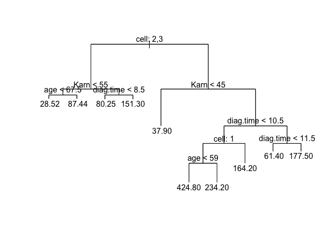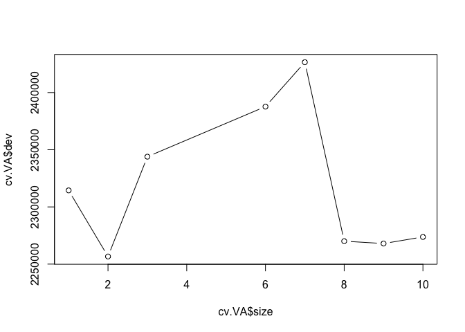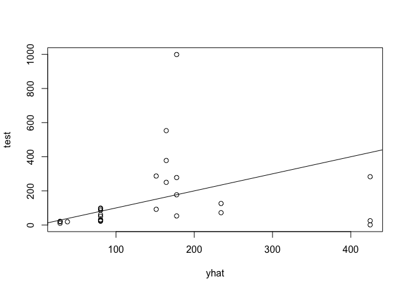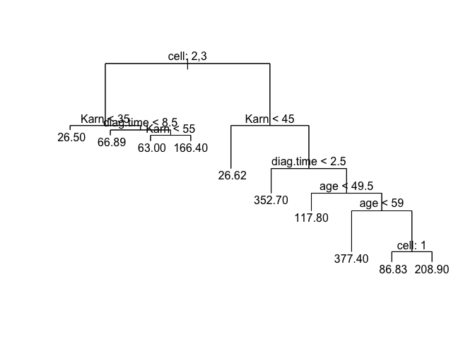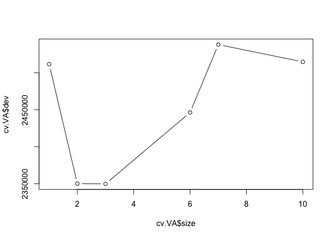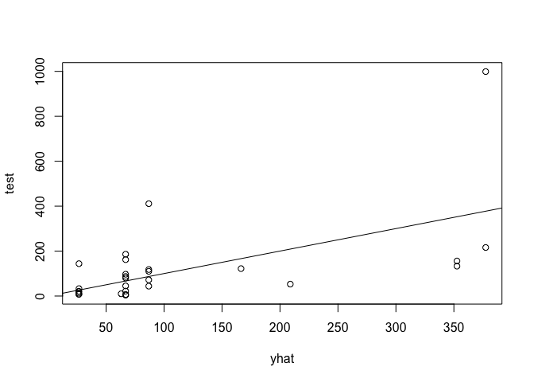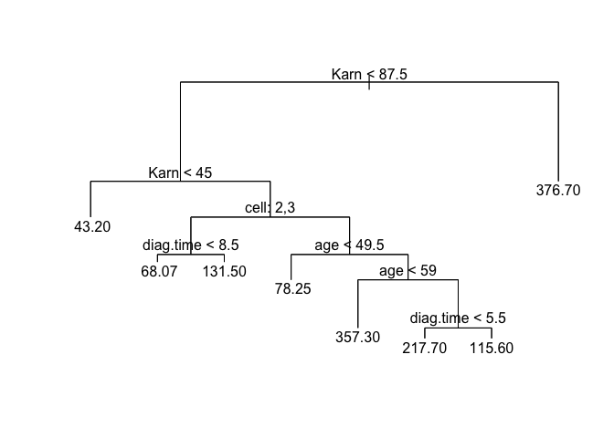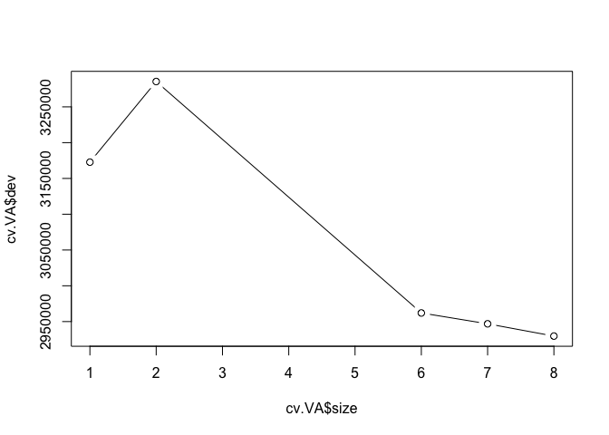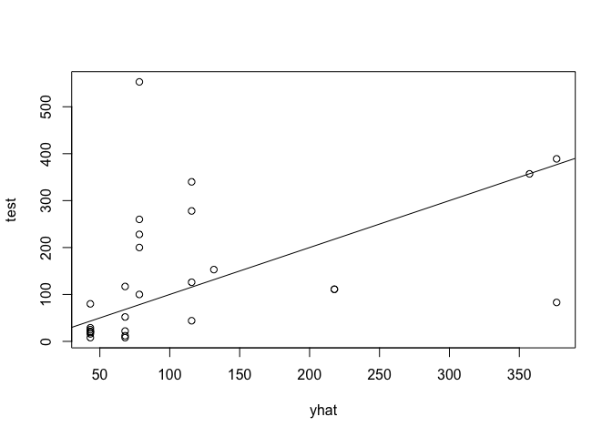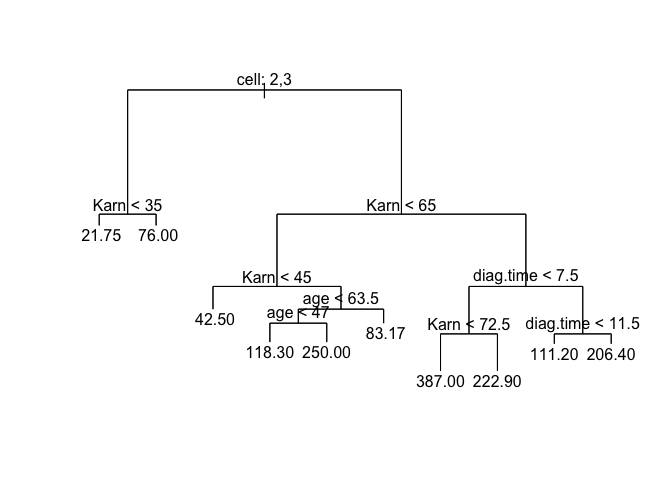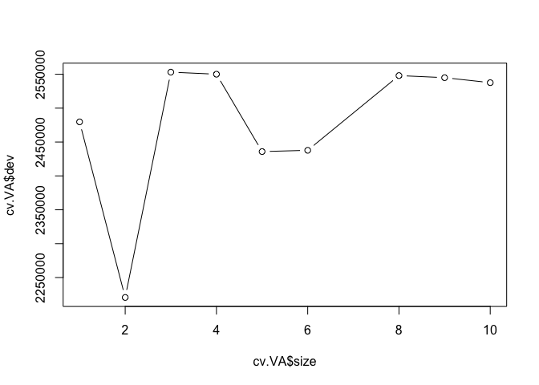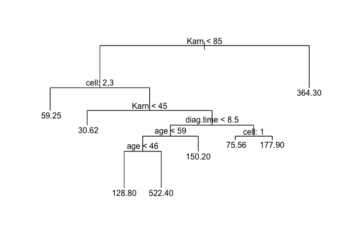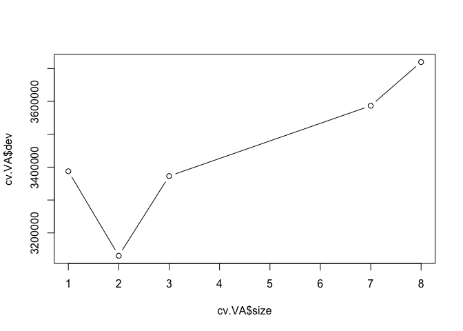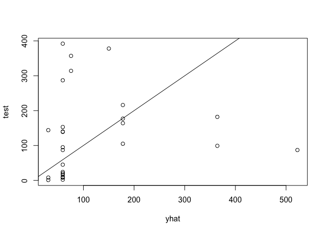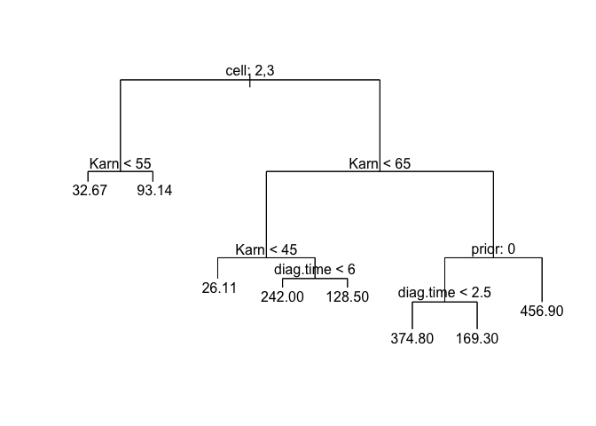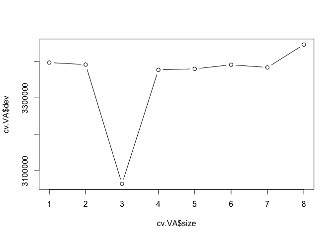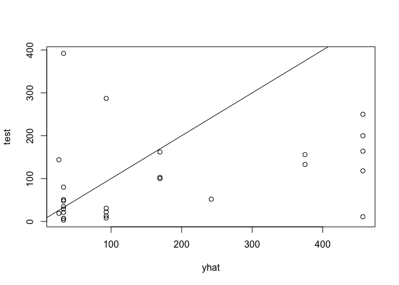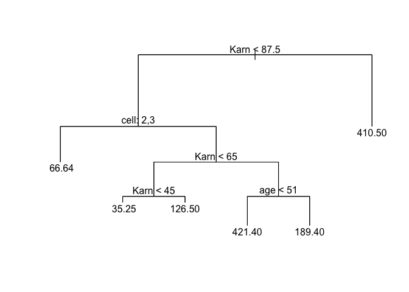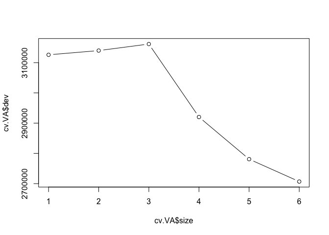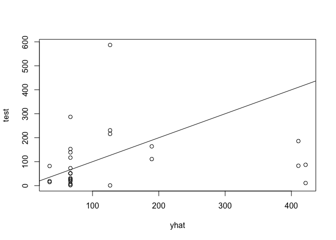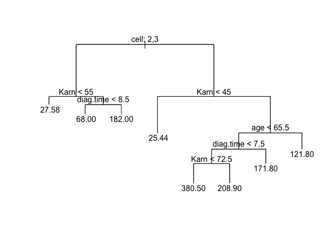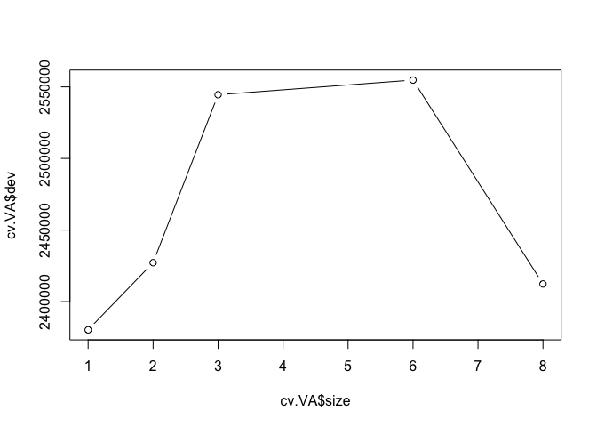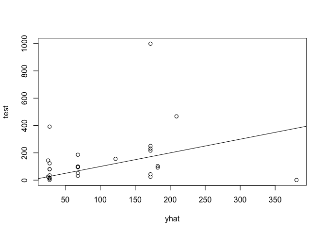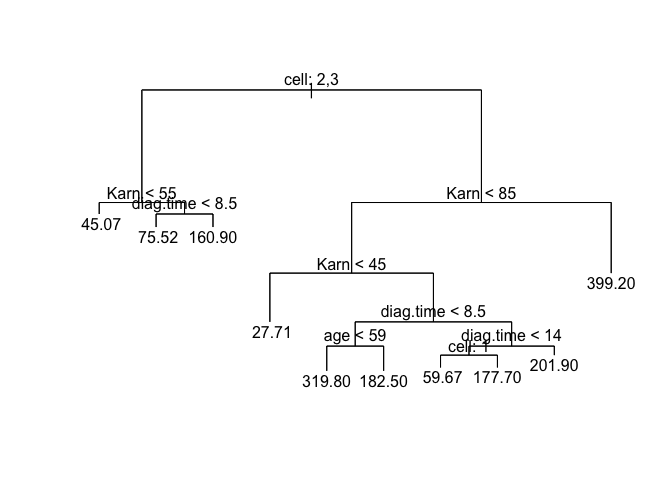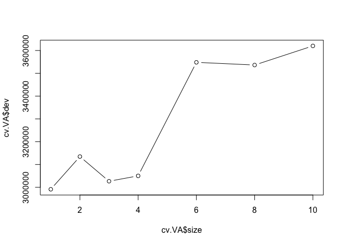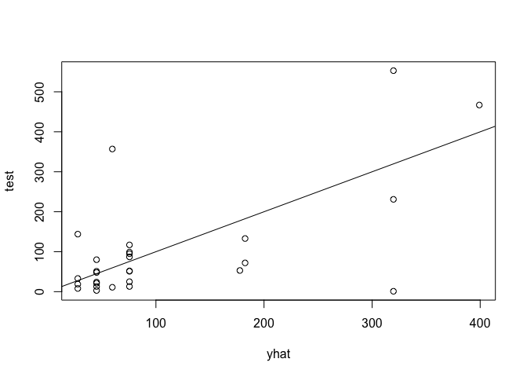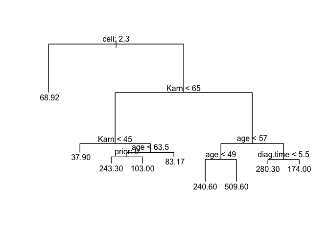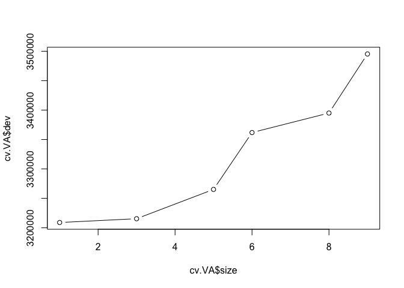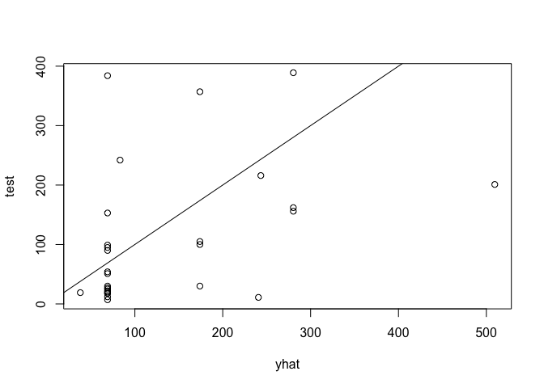

``` r
#Mean test prediction error
mean_test_prediction_error = mean_test_prediction_error/10
mean_test_prediction_error
```

    ## [1] 26959.52

``` r
########################################
##########  BAGGING  ###################
########################################
# Conduct bagging for regression tree to
# predict survival time and compare test error.

mean_test_prediction_error = 0

VA_data = subset(VA, select = -c(treat))

library(randomForest)
```

    ## randomForest 4.6-14

    ## Type rfNews() to see new features/changes/bug fixes.

``` r
set.seed(1)


for (i in 1:10) 
{
  train = sample(1:nrow(VA_data),nrow(VA_data)*.8)
  
  bag.VA = randomForest(stime~., data=VA_data,
                        subset=train, mtry=6,
                        importance=TRUE)
  summary(bag.VA)
  bag.VA
  
  yhat.bag = predict(bag.VA, newdata=VA_data[-train,])
  test = VA_data[-train, "stime"]
  
  test_prediction_error = mean((yhat.bag-test)^2)
  mean_test_prediction_error = mean_test_prediction_error + test_prediction_error
  
}

importance(bag.VA)
```

    ##               %IncMSE IncNodePurity
    ## status    -0.44755277      22732.94
    ## age       -3.55951781     620214.52
    ## Karn       9.39613089     936201.39
    ## diag.time  0.81376138     419241.25
    ## cell       8.18608544     507329.62
    ## prior     -0.05946441     103204.10

``` r
varImpPlot(bag.VA, main = "importance")
```

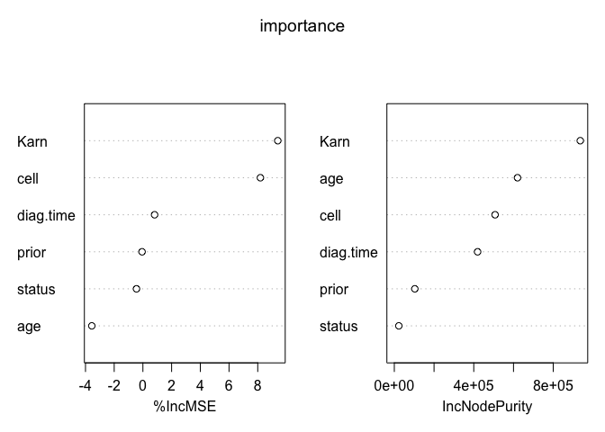

``` r
mean_test_prediction_error = mean_test_prediction_error/10
mean_test_prediction_error
```

    ## [1] 25913.49
